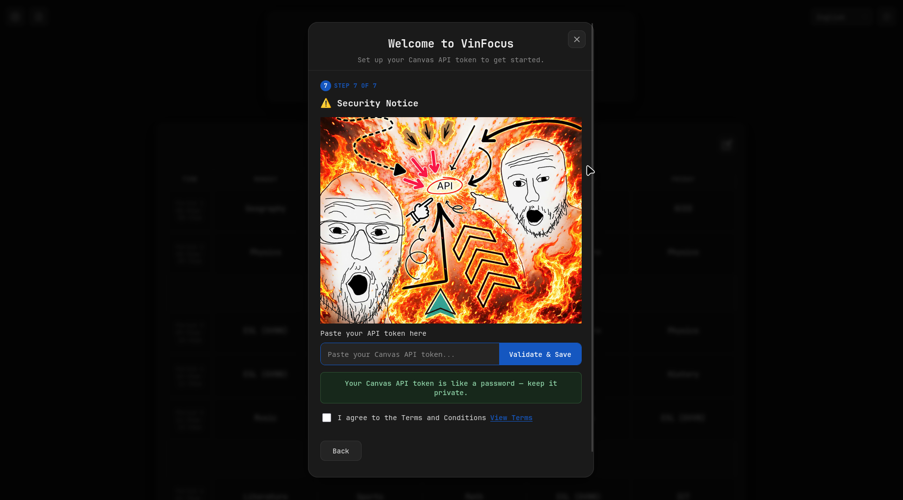
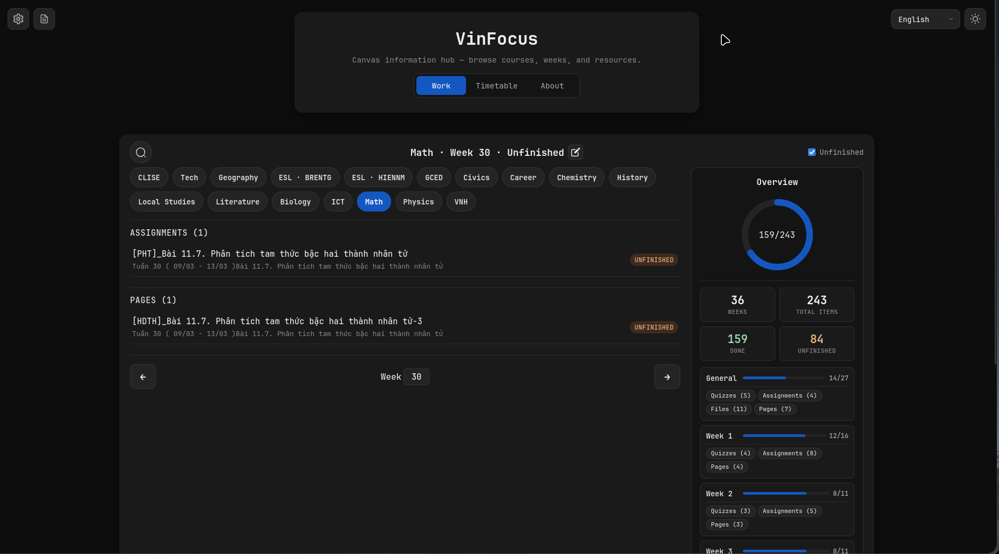
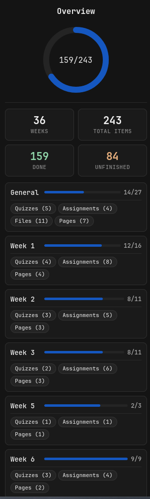
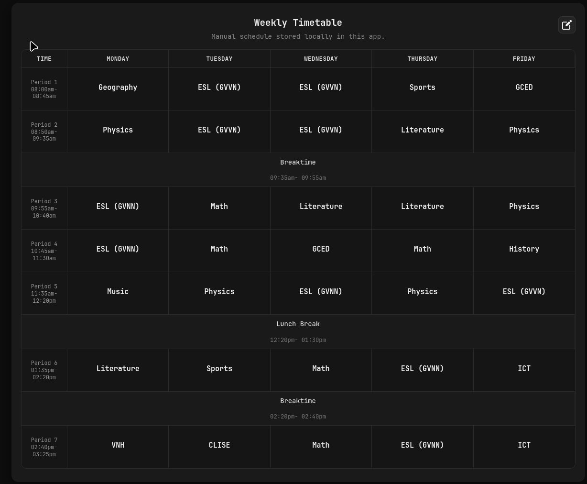

# VinFocus

VinFocus is a personal information hub for Vinschool's Canvas LMS, designed for Vinschool students. It aggregates course modules and items into a cleaner interface so you can browse what exists — without trying to predict what you should do on a given day.

## Demo

https://github.com/user-attachments/assets/1dbd77f9-af79-47db-9f85-02e0fa4c710c

## Screenshot

### Setup Wizard


### Work view


### Overview Dashboard


### Timetable


## Access

The app is hosted and ready to use at:

**https://vinschool-lms-dashboard.onrender.com/**

No installation or setup is required, just open the link, follow the setup wizard to generate and paste your Canvas API token, and start browsing.

## Why I Built This

Vinschool's Canvas LMS contains all the information students need, but finding it often requires navigating through multiple pages and module lists. As a result, students can spend more time searching for information than actually using it.

I built VinFocus to make course content easier to access without replacing Canvas itself. It organizes modules into weeks and presents quizzes, assignments, files, and other resources in a single searchable view. It also highlights unfinished work and provides a timetable view, reducing the amount of navigation required.

VinFocus is not designed to tell students what they should do each day. Instead, it helps answer questions such as:

- What quizzes exist for this week?
- What assignments exist for this week?
- What resources are available for this week?
- What items are still unfinished?
- Which modules belong to each week?

Students decide what to work on. VinFocus simply makes the information easier to find.

## Features

### Navigation
- Course browser
- Week navigation
- Search

### Productivity
- Unfinished filter
- Course overview dashboard
- Item importance

### Customization
- Themes
- Subject labels
- Bilingual UI

### Other
- Timetable
- Feedback

## Tech Stack

- **Python** — Backend logic and API
- **Flask** — Web framework
- **Flask-CORS** — Cross-origin resource sharing for frontend access
- **Requests** — HTTP client for Canvas API
- **psycopg2** — PostgreSQL database driver
- **python-dotenv** — Environment variable management
- **gunicorn** — Production WSGI server
- **pytest** — Testing framework
- **HTML / CSS / JavaScript** — Frontend

## API Endpoints

### Course-aware routes (current)

| Endpoint | Description |
|----------|-------------|
| `GET /api/courses` | Active courses for the authenticated user. Returns `{ course_count, courses: [{ id, name, course_code }] }`. |
| `GET /api/courses/<course_id>/weeks` | Week numbers found in module names. Week `0` is included if any modules have no week information. Returns `{ course_id, week_count, weeks: [int] }`. |
| `GET /api/courses/<course_id>/week/<week>` | Quizzes, assignments, and files for a week. Returns `{ course_id, course_name, week, item_count, items: [...] }`. |
| `GET /api/courses/<course_id>/week/<week>/unfinished` | Same items, filtered to incomplete Canvas work. Same response shape. |

### Token Management

| Endpoint | Description |
|----------|-------------|
| `POST /api/validate-token` | Validate a Canvas API token. Expects JSON body `{ "token": "..." }`. Returns `{ "valid": true/false, "message": "..." }`. |

### Health Check

| Endpoint | Description |
|----------|-------------|
| `GET /health` | Health check endpoint for monitoring. Returns `{ "status": "healthy", "service": "VinFocus", "database": "configured" or "not configured" }`. |

### Legacy routes (backward compatibility)

These routes use a hardcoded default course ID (`32140`) and exist for older clients:

| Endpoint | Description |
|----------|-------------|
| `GET /api/week/<week>` | Items for a week in the default course. Returns `{ course_id, course_name, week, item_count, items }`. |
| `GET /api/todo/<week>` | Unfinished items for a week in the default course. Returns `{ course_id, course_name, week, todo_count, todo }`. |

### Item response shape

Each item in the `items` array has the following fields:

```json
{
  "course_id": 123,
  "course_name": "Course Name",
  "module": "TUẦN 36",
  "title": "Quiz 1",
  "type": "Quiz",
  "completed": false,
  "module_item_id": 456,
  "url": "https://lms.vinschool.edu.vn/courses/123/quizzes/789"
}
```

Allowed item types: `Quiz`, `Assignment`, `File`, `Page`.

## How It Works

The Flask server in `main.py` proxies Canvas API requests. When you open the app for the first time, a setup wizard guides you through generating and pasting your Canvas API token. The token is sent with every request via the `Authorization` header, so no environment variable is needed for end users.

Helper functions fetch courses, modules, and module items, then format them into consistent JSON for the frontend.

The frontend in `script.js` loads courses, lets you pick a course and week, and renders items grouped by type. The timetable is stored locally in the browser's `localStorage` and is fully editable.

## Security

- Tokens are stored only in browser localStorage
- Tokens are never stored on VinFocus servers
- Tokens are only sent to Canvas-authenticated endpoints
- Users can revoke tokens at any time from Canvas

### Architecture notes

- **Caching** — In-memory cache with a 5-minute TTL and LRU eviction (max 1000 entries). Thread-safe with a lock.
- **Concurrency** — Module items are fetched in parallel using `ThreadPoolExecutor` (up to 8 workers).
- **Logging** — Structured logging with timestamps, log levels, and module names.
- **Week parsing** — A custom parser extracts week numbers from module names. Supports Vietnamese (`tuần`) and English (`week`) keywords, ranges (`-`, `–`), lists (`+`, `&`, `,`, `/`), and mixed formats.
- **Course code parsing** — Course codes like `THCS.OP-MATHS-TEACHER` are parsed to extract subject keys for labeling and filtering. Hidden subjects (`MUS`, `PE`, `ART`) are excluded from the course list.

## Running Locally

If you prefer to run the app on your own machine instead of using the hosted version:

1. Install dependencies:

```bash
pip install -r requirements.txt
```

This will install all required packages including Flask, Flask-CORS, psycopg2-binary, python-dotenv, gunicorn, and requests.

2. Start the app:

```bash
python main.py
```

3. Open `http://127.0.0.1:5000` in your browser.

4. On first launch, a setup wizard will appear. Follow the 7-step guide to generate and paste your Canvas API token. The token is stored in your browser and sent with each request — no server-side setup required.
 
> **Note:** Each token lasts up to 4 months. You'll need to repeat the setup about 2-3 times per school year. The app will warn you a week before the token expires.

## Running Tests

```bash
pytest test_main.py -v
```

The test suite covers:

- **Unit tests** for the `extract_weeks()` parser (single weeks, ranges, multi-week lists, edge cases, non-week modules).
- **Integration tests** for all API endpoints (success, missing token, API failure, week 0/general, range expansion, legacy routes).

## Environment Variables

| Variable | Default | Description |
|----------|---------|-------------|
| `API_TOKEN` | — | Canvas API token (optional — can be set via the UI wizard instead) |
| `DATABASE_URL` | — | PostgreSQL database URL (for feedback feature) |
| `ADMIN_API_KEY` | — | Secret key for accessing feedback data (auto-generated on Render) |
| `FLASK_DEBUG` | `"false"` | Enable Flask debug mode |
| `PORT` | `5000` | Port for the development server |

## Accessing Feedback Data

The feedback endpoint is protected and requires an admin API key for security. To view feedback submissions:

### On Render (Production)

1. Go to your Render dashboard
2. Navigate to your web service → **Environment** tab
3. Copy the value of `ADMIN_API_KEY` (auto-generated by Render)
4. Make a request with the admin key:

```bash
curl -H "X-Admin-Key: YOUR_ADMIN_KEY" https://vinschool-lms-dashboard.onrender.com/api/feedback
```

Or in your browser's developer console:

```javascript
fetch('/api/feedback', {
  headers: {
    'X-Admin-Key': 'YOUR_ADMIN_KEY'
  }
})
.then(r => r.json())
.then(console.log)
```

### Locally

Add `ADMIN_API_KEY` to your `.env` file:

```bash
ADMIN_API_KEY=your-secret-key-here
```

Then access feedback with:

```bash
curl -H "X-Admin-Key: your-secret-key-here" http://127.0.0.1:5000/api/feedback
```

**Note:** Never commit your `ADMIN_API_KEY` to version control. On Render, it's automatically generated and stored securely in the environment variables.

## Future Plans

- Timetable Automation (will implement when school starts)
- Global Search
- Add Unknown filter next to Unfinished

## Notes

This project needs a valid Canvas API token to load real data. Keep the token private and do not commit it to the repository.

## Author

Created by Phạm Lê Mạnh Hùng

## Contact

- Email: hung020121@gmail.com
- GitHub: https://github.com/PhamLeManhHung