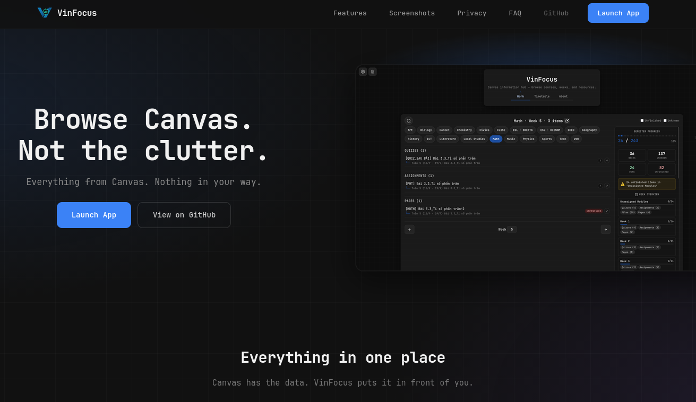
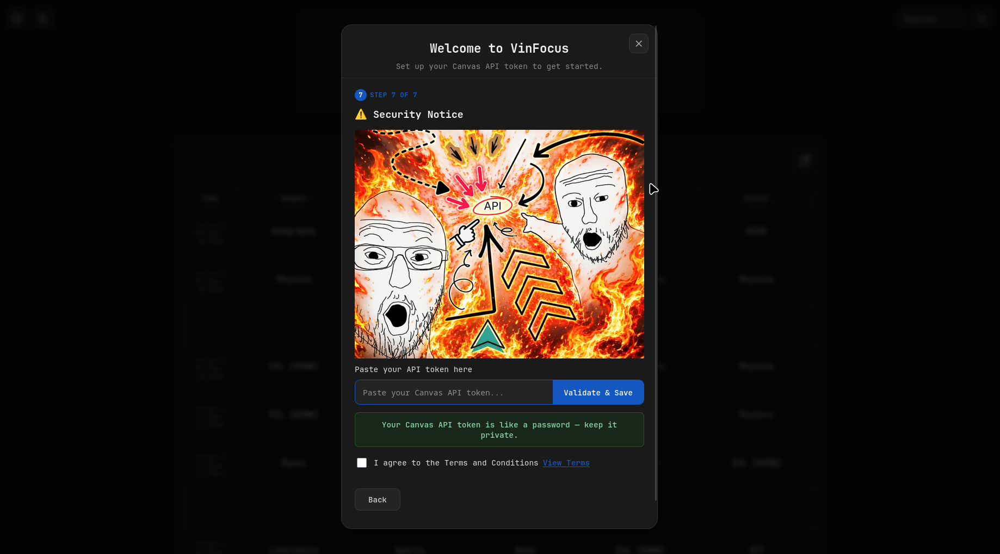
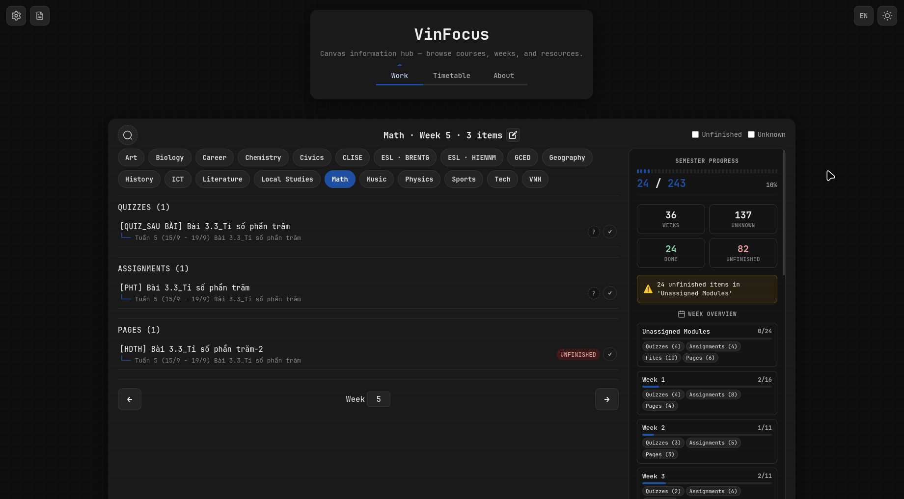
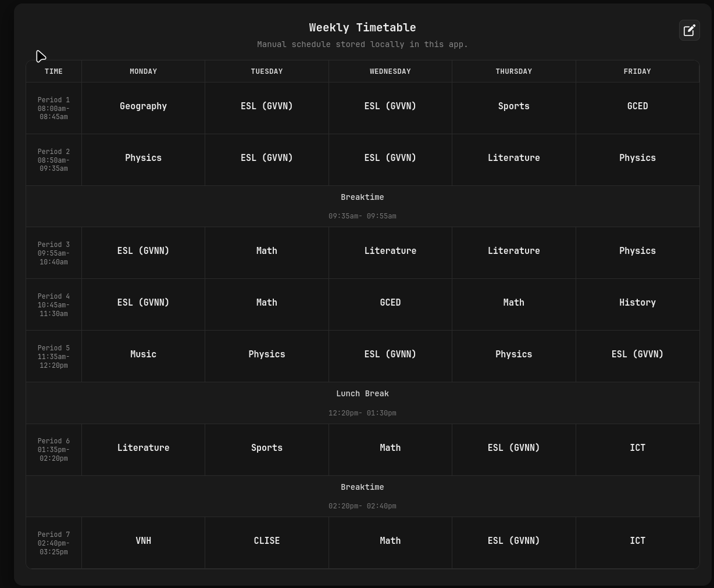

# VinFocus
> "Everything from Canvas. Nothing in your way."

VinFocus is a personal information hub for Vinschool's Canvas LMS, designed for Vinschool students. It aggregates course modules and items into a cleaner interface so you can browse what exists — without trying to predict what you should do on a given day.

## Demo

https://github.com/user-attachments/assets/c0bf2085-5e51-4b41-b13e-41436c0d9945

## Access

The app is hosted and ready to use at:

**https://vinfocus.onrender.com/**

No installation or setup is required, just open the link, follow the setup wizard to generate and paste your Canvas API token, and start browsing.

## Screenshots

### Landing Page


### Setup Wizard


### Work View


### Timetable


## Why I Built This

Vinschool's Canvas LMS contains all the information students need, but finding it often requires navigating through multiple pages and module lists. As a result, students can spend more time searching for information than actually using it.

I built VinFocus to make course content easier to access without replacing Canvas itself. It organizes modules into weeks and presents quizzes, assignments, files, and other resources in a single searchable view. It also highlights unfinished work and provides a timetable view, reducing the amount of navigation required.

VinFocus is not designed to tell students what they should do each day. Instead, it helps answer questions such as:

- What quizzes exist for this week?
- What assignments exist for this week?
- What resources are available for this week?
- What items are still unfinished?
- Which modules belong to each week?

Students decide what to work on. VinFocus simply makes the information easier to find.

## Why Not Just Use Vinschool LMS?

Canvas contains all the information students need, but navigating between courses, modules, assignments, quizzes, and files often requires many clicks.

VinFocus doesn't replace Canvas. It reorganizes the same information into a faster, searchable interface.

## Keyboard Shortcuts

| Shortcut | Action |
|----------|--------|
| `j` or `←` | Previous week |
| `k` or `→` | Next week |
| `g` | Focus week input |
| `d` | Toggle unfinished filter |
| `f` | Toggle unknown filter |

## Features

### Navigation
- Course browser with pill-style navigation
- Week navigation with keyboard shortcuts (`j`/`k` to move, `g` to jump)
- Search across courses, modules, quizzes, assignments, and files

### Productivity
- Unfinished filter — filter items to only those explicitly tracked as incomplete by Canvas
- Unknown filter — filter items that have no completion tracking (Canvas doesn't report completion status)
- Semester progress dashboard — per-week item counts, completion stats, type breakdowns, and a visual progress bar
- Item importance — items matching keywords like `HKII`, `HS1`, `cuối năm` are visually highlighted as important
- Manual completion override — mark any item as done even without Canvas tracking; stored in browser localStorage with undo support
- Course progress bars — each course pill shows completion percentage

### Customization
- Dark/light theme toggle
- Subject labels — rename-only (no color customization)
- Bilingual UI (English/Vietnamese)

### Timetable
- Weekly timetable grid with Monday–Friday periods
- Current period and today column highlighting
- Next period highlighting
- Inline editing with desktop dropdown and mobile modal
- Today vs full week view toggle on mobile
- Data stored locally in browser

### About View
- App description and usage instructions
- How-to guide covering all major features

### Notices & Banners
- **Token expiry warning** — warns when your Canvas API token is about to expire or has already expired
- **Consent banner** — asks for permission to use localStorage for token persistence; falls back to sessionStorage if declined
- **Unassigned work warning** — in the overview dashboard, warns about unfinished items in modules without a week assignment
- **Terms & Conditions** — modal with privacy and usage terms, accessible from the consent banner

### Offline Support
- Service worker with network-first strategy for API calls
- Cache-first for static assets
- Previously loaded data remains accessible offline

### Other
- Feedback form
- Keyboard shortcuts
- Skeleton loading states
- Progressive loading messages for slow Canvas responses
- Client-side API response cache (5-minute TTL, 500 max entries)

## Tech Stack

- **Python** — Backend logic and API
- **Flask** — Web framework
- **Flask-CORS** — Cross-origin resource sharing for frontend access
- **Flask-Talisman** — Security headers (Content Security Policy)
- **Flask-Compress** — Response compression
- **Requests** — HTTP client for Canvas API
- **psycopg2-binary** — PostgreSQL database driver
- **python-dotenv** — Environment variable management
- **gunicorn** — Production WSGI server
- **pytest** — Testing framework
- **HTML / CSS / JavaScript** — Frontend

## API Endpoints

### Course-aware routes (current)

| Endpoint | Description |
|----------|-------------|
| `GET /api/courses` | Active courses for the authenticated user. Returns `{ course_count, courses: [{ id, name, course_code }] }`. |
| `GET /api/courses/<course_id>/weeks` | Week numbers found in module names. Week `0` is included if any modules have no week information. Returns `{ course_id, week_count, weeks: [int] }`. |
| `GET /api/courses/<course_id>/week/<week>` | Quizzes, assignments, and files for a week. Returns `{ course_id, course_name, week, item_count, items: [...] }`. |
| `GET /api/courses/<course_id>/week/<week>/unfinished` | Same items, filtered to incomplete Canvas work. Same response shape. |
| `GET /api/courses/<course_id>/overview` | Overview data for a course: all weeks with item counts, completion stats (done/unfinished/unknown), type breakdowns, and uncategorized warning count. Returns `{ course_id, course_name, week_count, weeks: [...], totals: { total, done, unfinished, unknown }, uncategorized_unfinished_count: int }`. |

### Token Management

| Endpoint | Description |
|----------|-------------|
| `POST /api/validate-token` | Validate a Canvas API token. Expects JSON body `{ "token": "..." }` and `X-CSRF-Token` header. Returns `{ "valid": true/false, "message": "..." }`. Rate limited: 5 requests/minute. |
| `GET /api/csrf-token` | Get a CSRF token for POST endpoints. The frontend should include this token in the `X-CSRF-Token` header when making POST requests. Returns `{ "csrf_token": "..." }`. |

### Feedback

| Endpoint | Description |
|----------|-------------|
| `GET /api/feedback` | Get all feedback submissions. Requires `X-Admin-Key` header with the admin API key. |
| `POST /api/feedback` | Submit user feedback. Expects JSON body `{ "rating": int (1-5), "usage_type": str, "recommend": str, "improvement": str }` and `X-CSRF-Token` header. Rate limited: 10 requests/minute. |
| `DELETE /api/feedback/<feedback_id>` | Delete a specific feedback entry by ID. Requires `X-Admin-Key` header. Returns `{ "success": true/false, "message": "..." }`. |

### Health Check

| Endpoint | Description |
|----------|-------------|
| `GET /health` | Health check endpoint for monitoring. Returns `{ "status": "healthy", "service": "VinFocus", "database": "configured" or "not configured", "database_detail": "ok" or "no database URL configured" or "connection failed", "version": "2.2" }`. |

### Legacy routes (backward compatibility)

These routes use a hardcoded default course ID (`32140`) and exist for older clients:

| Endpoint | Description |
|----------|-------------|
| `GET /api/week/<week>` | Items for a week in the default course. Returns `{ course_id, course_name, week, item_count, items }`. |
| `GET /api/todo/<week>` | Unfinished items for a week in the default course. Returns `{ course_id, course_name, week, todo_count, todo }`. |

### Item response shape

Each item in the `items` array has the following fields:

```json
{
  "course_id": 123,
  "course_name": "Course Name",
  "module": "TUẦN 36",
  "title": "Quiz 1",
  "type": "Quiz",
  "completed": false,
  "has_tracking": true,
  "module_item_id": 456,
  "url": "https://lms.vinschool.edu.vn/courses/123/quizzes/789"
}
```

- `completed`: `true` if tracked and done, `false` if tracked and not done, `null` if no completion tracking exists (unknown).
- `has_tracking`: `true` if Canvas reports a completion requirement for this item, `false` otherwise.

Allowed item types: `Quiz`, `Assignment`, `File`, `Page`.

## How It Works

The Flask server in `main.py` proxies Canvas API requests. When you open the app for the first time, a setup wizard guides you through generating and pasting your Canvas API token. The token is sent with every request via the `Authorization` header, so no environment variable is needed for end users.

The frontend loads courses, lets you pick a course and week, and renders items grouped by type. The timetable is stored locally in the browser's `localStorage` and is fully editable. The app also includes an overview sidebar with semester progress, week cards, and completion stats.

A service worker (`static/sw.js`) provides offline support with network-first API calls and cache-first static assets.

## Security

- Tokens are stored only in browser localStorage (or sessionStorage if consent is declined)
- Tokens are never stored on VinFocus servers
- Tokens are only sent to Canvas-authenticated endpoints
- Users can revoke tokens at any time from Canvas
- Feedback submission (`POST /api/feedback`) requires a CSRF token obtained from `GET /api/csrf-token`
- Feedback admin access requires an `X-Admin-Key` header with constant-time comparison
- Content Security Policy headers restrict script and style sources
- CORS is restricted to specific origins
- Request body size limited to 1MB
- IP addresses are redacted from logs via privacy filter
- Rate limiting per IP address using token bucket algorithm

## Architecture Notes

- **Caching** — In-memory cache with a 5-minute TTL (same for all endpoints) and FIFO eviction (max 1000 entries). When the cache exceeds the limit, the oldest 20% of entries are evicted. Thread-safe with a lock. Cache keys include a SHA256 hash of the user's token to prevent data leaks between users.
- **Concurrency** — Module items are fetched using `get_course_modules(include_items=True)` to fetch all items in a single API call, eliminating N+1 requests.
- **Rate limiting** — Token bucket algorithm per IP address. General endpoints: 300 requests per 60-second window. Token validation: 5 requests per 60-second window. Feedback submission: 10 requests per minute.
- **Logging** — Structured logging with timestamps, log levels, and module names. IP addresses are redacted.
- **Week parsing** — A custom parser extracts week numbers from module names. Supports Vietnamese (`tuần`, `tuân`, `tuan`) and English (`week`) keywords, ranges (`-`, `–`), lists (`+`, `&`, `,`, `/`, `=`), and mixed formats. Uses `functools.lru_cache` (maxsize=256) for caching parsed results.
- **Course code parsing** — Course codes like `THCS.OP-MATHS-TEACHER` are parsed to extract subject keys for labeling and filtering.
- **CSRF protection** — Server-generated tokens with 1-hour expiry, validated on POST endpoints. Stale tokens are cleaned up periodically.
- **Database** — PostgreSQL connection pool (min 2, max 20 connections) for feedback storage.
- **Client-side caching** — API response cache with 5-minute TTL and 500 max entries. AbortController cancels stale requests.

## Running Locally

If you prefer to run the app on your own machine instead of using the hosted version:

1. Install dependencies:

```bash
pip install -r requirements.txt
```

This will install all required packages including Flask, Flask-CORS, Flask-Talisman, Flask-Compress, psycopg2-binary, python-dotenv, gunicorn, requests, and pytest.

2. Start the app:

```bash
python main.py
```

3. Open `http://127.0.0.1:5000` in your browser.

4. On first launch, a setup wizard will appear. Follow the 7-step guide to generate and paste your Canvas API token. The token is stored in your browser and sent with each request — no server-side setup required.
 
> **Note:** Each token lasts up to 4 months. You'll need to repeat the setup about 2-3 times per school year. The app will warn you a week before the token expires.

## Running Tests

```bash
pytest tests/ -v
```

The test suite covers:

- **Unit tests** for the `extract_weeks()` parser (single weeks, ranges, multi-week lists, edge cases, non-week modules).
- **Unit tests** for `get_item_completion()` and `format_module_item()` (three-state completion: done, unfinished, unknown).
- **Integration tests** for all API endpoints (success, missing token, API failure, week 0/general, range expansion, legacy routes, overview endpoint, three-state completion, feedback endpoints).

Additionally, `tests/test_fixes.py` is a standalone verification script that can be run directly:

```bash
python tests/test_fixes.py
```

## Environment Variables

| Variable | Default | Description |
|----------|---------|-------------|
| `API_TOKEN` | — | Canvas API token (optional — can be set via the UI wizard instead) |
| `DATABASE_URL` | — | PostgreSQL database URL (for feedback feature) |
| `ADMIN_API_KEY` | — | Secret key for accessing feedback data. On Render, this is auto-generated. |
| `FLASK_DEBUG` | `"false"` | Enable Flask debug mode |
| `PORT` | `5000` | Port for the development server |

## Deployment

The app is configured for deployment on Render using `render.yaml`. Key settings:

- **Build**: `pip install -r requirements.txt`
- **Start**: `gunicorn main:app --bind 0.0.0.0:$PORT --workers 4 --timeout 120`
- **Plan**: Free tier
- **Health check**: `/health`
- **Database**: Free PostgreSQL database (`vinfocus_feedback`)
- **Auto-deploy**: Enabled

## Accessing Feedback Data

The feedback endpoint is protected and requires an admin API key for security. To view feedback submissions:

### On Render (Production)

1. Go to your Render dashboard
2. Navigate to your web service → **Environment** tab
3. Copy the value of `ADMIN_API_KEY` (auto-generated by Render)
4. Make a request with the admin key:

```bash
curl -H "X-Admin-Key: YOUR_ADMIN_KEY" https://vinfocus.onrender.com/api/feedback
```

Or in your browser's developer console:

```javascript
fetch('/api/feedback', {
  headers: {
    'X-Admin-Key': 'YOUR_ADMIN_KEY'
  }
})
.then(r => r.json())
.then(console.log)
```

### Locally

Add `ADMIN_API_KEY` to your `.env` file:

```bash
ADMIN_API_KEY=your-secret-key-here
```

Then access feedback with:

```bash
curl -H "X-Admin-Key: your-secret-key-here" http://127.0.0.1:5000/api/feedback
```

**Note:** Never commit your `ADMIN_API_KEY` to version control. On Render, it's automatically generated and stored securely in the environment variables.

## Future Plans

- Automatic timetable import from VSC Timetable (will implement when school starts)
- Cross-course global search
- Resource page
- Split view mode (Experimental)

## Notes

This project needs a valid Canvas API token to load real data. Keep the token private and do not commit it to the repository.

## License

MIT License — see [LICENSE](LICENSE) for details.

## Author

Created by Phạm Lê Mạnh Hùng

## Contact

- Email: hung020121@gmail.com
- GitHub: https://github.com/PhamLeManhHung